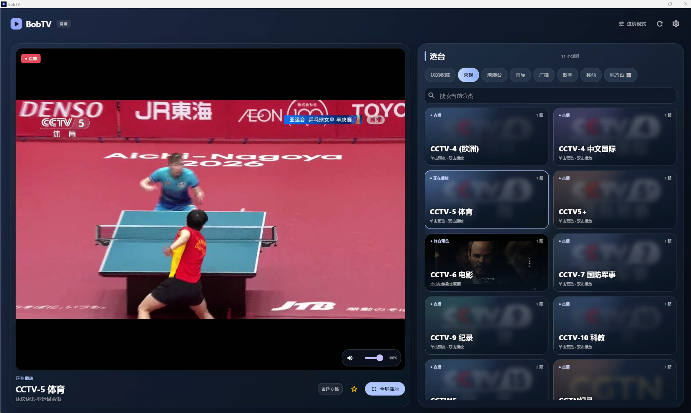

# BobTV

## BobTV website and API

The source for [bobtv.briconbric.com](https://bobtv.briconbric.com), including its frontend, Python backend, deployment configuration, and tests, lives in [`website/`](website/README.md). The [application API contract](website/API.md) is maintained alongside the site. The Windows app remains under `lib/` and `windows/`. Published packages are mirrored to the BobTV host so visitors download from that host.

BobTV is a Windows-focused IPTV player built from the open source [clubTivi](https://github.com/clubanderson/clubTivi) project. It provides a Chinese interface, automatic stream selection, silent failover, programme guide support, and borderless fullscreen playback on a computer connected to a television.

The application is built with Flutter and uses `media_kit`, libmpv, FFmpeg, Riverpod, Drift, and SQLite.

<p align="center">
  
</p>

## Highlights

* AirPlay video casting on Windows, including a native Mac receiver path with 720p H.264 video and stereo audio. On the receiving Mac, allow Everyone and disable Require Password; no PIN is requested. Other compatible receivers use a mouse operated pairing keypad and bounded HLS relay. Open the fullscreen player's cast button. Desktop mirroring, password protected receivers and audio-only speakers are not supported. Native-Mac pause/volume controls are not yet enabled. See [AirPlay build and compatibility notes](tools/airplay/README.md).

### One channel, multiple hidden routes

Equivalent channel entries from different M3U providers are normalized and shown as one channel. Quality labels, common route labels, full width characters, and Chinese CCTV aliases are handled by a CJK safe name normalizer.

The route list remains hidden from the normal channel browser. Users select a channel, while the player manages its available streams in the background.

### Fast route selection

Before playback, the player can test up to 24 equivalent HTTP or HTTPS streams in parallel. Selection uses:

* Time to first byte
* Short transfer throughput
* Persisted stream health history
* Previous buffering and stall observations
* Six hour time windows that learn recurring changes in route quality

Successful probes increase route weight according to latency and throughput. Connection failures and playback stalls reduce route weight. Old observations decay toward a neutral score so recovered routes can be tried again. The probe has a bounded timeout. If probing cannot produce a usable result, playback falls back to the original route.

### Silent automatic failover

The player monitors the libmpv demuxer cache, buffering state, and playback position during playback. Missing cache telemetry and a frozen playback position can trigger failover, which covers streams that stop without reporting a normal buffering event. When the active route remains unhealthy, the player prepares another route and verifies that real audio or video playback has started before keeping the switch. Failed candidates are excluded for the current channel session and the previous route is restored automatically. Manual buffering confirmation dialogs have been removed. A short Chinese notification is shown only after a successful switch.

### Chinese programme guide

The fork includes bootstrap configuration for Chinese XMLTV sources and supports:

* CCTV and CCTV Plus schedules
* Strict separation of CCTV5 and CCTV5 Plus during EPG matching
* Chinese satellite and regional channels
* Fixed sports channels available in the configured XMLTV data
* CJK channel name matching
* `tvg-id`, explicit mapping, normalized name, and call sign matching
* Per channel EPG time shift

Generic event slots such as numbered temporary sports feeds need a reliable external mapping before they can receive accurate event names.

### Windows television mode

The channel browser remains a normal maximized Windows window with its title bar, minimize control, and close control. The player switches the window into a borderless fullscreen state that covers the current monitor, then restores the normal frame when playback is left.

Additional Windows behavior includes:

* Double click a channel to open the player
* Double click video or press `F11` to toggle the player fullscreen state
* Use the on screen `退出全屏` and `返回频道` buttons with a mouse
* Scheduled task friendly startup
* Crash dump support when configured during deployment
* Chinese application title without encoding corruption

### Stability and memory controls

This fork includes several changes for long running playback:

* Bounded media buffers for the main and warm players
* Serialized player and warm player lifecycle operations
* Generation guards for rapid channel changes
* Serialized channel database reloads
* Cached channel normalization and route indexes
* Bounded parallel network probes
* Persisted health scores with time decay
* Time window route scoring for recurring peak hour congestion

### Self-maintaining playlist catalogue

The application checks HTTP and HTTPS routes in small background batches every six hours. A route is retired only after five consecutive failures spanning at least 24 hours. Previously failing routes are checked first, and a batch with no successful connections is discarded when it indicates a wider network outage. Retired routes stay excluded from later playlist imports. Channels with no remaining routes disappear automatically, along with categories that become empty.

For configured GitHub backed playlists, the local database records the source URL, repository owner, repository name, branch, file path, and last observed Git object version. Repository versions are checked every six hours through the public GitHub API. A changed playlist resets its retired route records, refreshes the provider, and submits the new routes to health checks again. No GitHub credential is embedded in the application.

### AI assisted GitHub crawler

An optional crawler can supplement the configured playlists with newly discovered GitHub sources. It asks an OpenAI compatible Chat Completions endpoint to generate repository searches, inspect complete repository tree metadata, select arbitrary candidate documents, classify their storage format, extract stream records, and identify child documents for recursive traversal. Repository trees that exceed the recursive Git API response are traversed directory by directory. Selection does not depend on a fixed playlist path or filename extension.

M3U documents are expanded by the strict local parser after AI file selection. JSON, YAML, text, generated data, and other layouts are analyzed in bounded chunks with structured JSON Schema output. Repository content is treated as untrusted data and cannot supply instructions to the model. Only same repository GitHub document links are eligible for recursive fetching.

Discovered routes are placed in the existing channel aggregation and failover system. Each route retains its repository, commit, file path, source document URL, confidence, and first and last discovery times. The crawler runs at most once per day, processes five repositories per pass, and prefers three configured repositories plus two newly discovered repositories.

The Settings screen accepts an OpenAI-compatible HTTPS endpoint, model ID, and API key for optional classification and source discovery. The key stays in platform secure storage. Process environment variables remain a fallback when no settings have been saved:

* `OPENAI_BASE_URL`
* `OPENAI_API_KEY`
* `OPENAI_MODEL`, optional and defaulting to `gpt-5.6-luna`

If the AI configuration is incomplete or disabled, uncertain channel classifications remain in Other and AI source discovery stays off. Playback, the programme guide, normal provider refreshes, route health checks, and GitHub version monitoring continue to operate. Credentials are never written to the repository or application logs.

Release builds include a sanitized bundled snapshot of the latest discovered routes. A new installation imports the snapshot automatically, so customers receive the release time channel candidates even when the optional AI endpoint is unavailable. The snapshot contains public stream metadata and GitHub provenance only. It excludes favorites, playback history, route health history, diagnostics, crash dumps, and API configuration. Later crawler passes update these candidates when runtime AI configuration is available.

### Website channel synchronization

Windows and macOS share the website's versioned, preclassified public channel catalog. A new installation starts with local or packaged channels and imports the verified website snapshot in the background. Snapshots include route revisions and shared health scores, and clients check for changes every minute.

Public additions, metadata and category edits, positive and negative health observations, deletions and retirements enter a durable SQLite outbox and upload asynchronously. Offline changes survive restart, acknowledgements remove only the exact event, and server deduplication prevents repeated scoring. Version checks protect newer classifications; retirement tombstones prevent stale clients from restoring removed URLs. New candidate routes require server verification before publication. A legitimate empty catalog removes the last retired channels and unused categories; network or validation failures preserve existing local data.

Favorites, playback history, private subscriptions and account-bearing URLs remain local. Sync progress appears beside the channel list. See [`docs/channel-catalog-sync.md`](docs/channel-catalog-sync.md) for the lifecycle and HTTP acceptance test, [`website/API.md`](website/API.md) for the contract, and [`website/README.md`](website/README.md) for publication and release-content maintenance.

## Included source bootstrap

The application can bootstrap several public M3U playlists and Chinese XMLTV endpoints on first launch. These endpoints are stored in the source code so they can be reviewed, changed, disabled, or removed.

Public stream availability changes frequently and may depend on network location, IPv4 or IPv6 access, provider policy, and regional restrictions. The player does not operate or control any external playlist, stream, or EPG service.

## Main technologies

| Area | Technology |
| --- | --- |
| User interface | Flutter and Dart |
| State management | Riverpod |
| Playback | media_kit, libmpv, and FFmpeg |
| Database | Drift and SQLite |
| Playlist parsing | M3U, M3U Plus, and Xtream Codes |
| Programme guide | XMLTV |
| Windows integration | Win32 Runner and window_manager |

## Requirements

For the Windows build:

* Windows 11
* Flutter SDK with Windows desktop support
* Visual Studio 2022 with the Desktop development with C++ workload
* Git

This fork has been built and tested with Flutter 3.44.6.

## Build on Windows

```powershell
git clone https://github.com/sunshaoxuan/clubTivi4bob.git
cd clubTivi4bob
flutter pub get
flutter test
flutter build windows --release
```

The release directory is:

```text
build\windows\x64\runner\Release
```

Copy the complete `Release` directory when installing the application. The executable requires the DLLs and data files generated beside it.

## Run during development

```powershell
flutter run -d windows
```

Other Flutter targets remain in the repository, although this fork is maintained primarily for the Windows 11 television host.

## Basic controls

| Input | Action |
| --- | --- |
| Single click a channel | Select and preview |
| Double click a channel | Open the full player |
| Double click video | Toggle player fullscreen state |
| On screen `退出全屏` | Restore the normal Windows frame |
| On screen `返回频道` | Leave playback and return to the channel browser |
| `F11` or `F` | Toggle player fullscreen state |
| `Escape` | Close an overlay or leave the player |
| Arrow keys | Navigate channels or adjust volume according to the active view |
| Channel Up or Channel Down | Change channel in the player |
| `D` | Open channel diagnostics from the channel view |

## Project layout

```text
lib/
  app/                       Application shell, routing, and theme
  data/datasources/         Drift database, M3U, and XMLTV parsing
  data/services/            EPG refresh, name normalization, and health data
  features/channels/        Channel browser, search, guide, and aggregation
  features/player/          Playback, probing, buffering, and failover
  features/providers/       Provider bootstrap and management
  features/settings/        Application and EPG settings
windows/runner/             Native Windows title and borderless TV window
test/                       Parser, mapping, bootstrap, and widget tests
```

## Validation

Run the automated test suite with:

```powershell
flutter test
```

Run static analysis with:

```powershell
flutter analyze
```

Windows release builds should also be tested on the target display because GPU drivers, codecs, monitor topology, and stream reachability vary by host.

## Privacy and updates

The original upstream update check and notifications remain disabled. Windows and macOS use the BobTV-owned HTTPS mirror, verify package size and SHA-256, install after the player exits, and retain a previous-version backup for startup rollback. macOS also verifies a BobTV publisher signature. The player shows preparation, live download progress, verification and readiness separately. After exit, a native progress window reports backup, installation, completion or failure, with a button to open BobTV again. Reopening the player observes an existing update task instead of starting a duplicate. See [Windows automatic updates](docs/windows-updates.md) and [macOS support](docs/macos-bobtv.md) for the contracts and release procedures. Older Windows installations affected by the updater launch failure need one manual installation of version 0.9.1+73 or later. Playlist and EPG refreshes remain available independently.

Stream health metrics and application configuration are stored locally by the application. After an automatic rollback, the updater sends a bounded, URL-redacted startup failure report to the configured BobTV HTTPS endpoint and queues it locally when upload is unavailable. Memory dumps are not uploaded. Review the configured provider URLs before distributing a customized build.

## Legal notice

BobTV is a media player. It does not host, retransmit, sell, or guarantee access to television content. Repository maintainers do not control third party playlists, streams, logos, metadata, or programme guides.

Users and deployers are responsible for verifying that they have permission to access and display every configured source and for complying with applicable copyright, contract, network, and broadcasting rules.

## Upstream and license

This project is derived from [clubTivi](https://github.com/clubanderson/clubTivi). Upstream authors and contributors retain credit for their work.

The repository is licensed under the Apache License 2.0. See [LICENSE](LICENSE) for the complete license text.

Contributions are welcome. See [CONTRIBUTING.md](CONTRIBUTING.md) for the upstream contribution guidelines.
